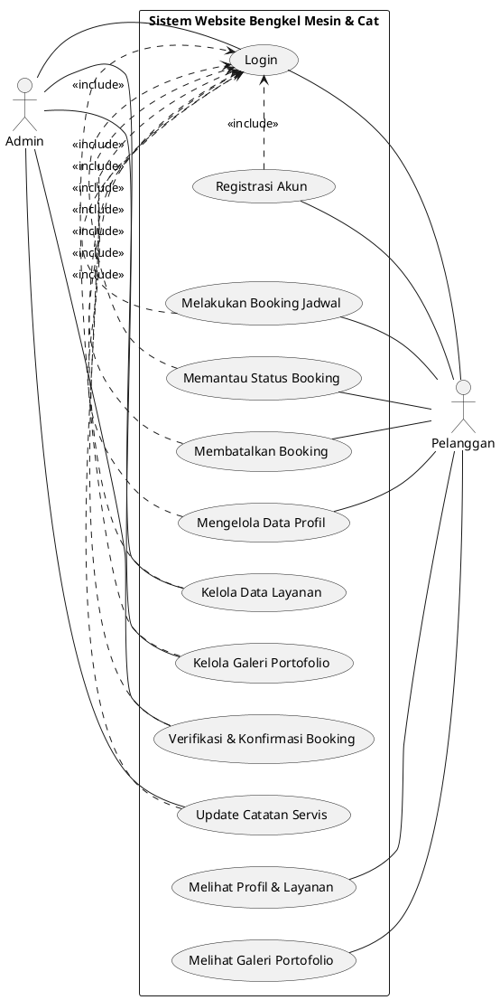

# Use Case Diagram - Website Bengkel (Sesuai Referensi <<include>>)

File ini berisi kode (*script*) untuk menghasilkan (me-render) gambar Use Case Diagram secara otomatis. Kode ini sudah **disesuaikan dengan gaya gambar referensi Anda**, yaitu:
1. **Admin berada di sebelah kiri** dan **Pelanggan di sebelah kanan**.
2. **Login berada di tengah** sebagai pusat.
3. Fitur-fitur utama menggunakan garis putus-putus **`<<include>>`** yang mengarah ke *Login* (menandakan bahwa untuk melakukan fitur tersebut, pengguna wajib *Login* terlebih dahulu).
4. Semua fitur lengkap Anda tidak ada yang dikurangi.

## Menggunakan PlantUML (Sangat Disarankan & Sesuai Referensi)
**Cara menggunakan:**
1. Buka situs web **[PlantText.com](https://www.planttext.com/)** atau **[PlantUML Web Server](http://www.plantuml.com/plantuml/uml/)**.
2. Salin (*copy*) semua teks di dalam kotak kode di bawah ini.
3. Tempel (*paste*) ke dalam kotak teks di situs web tersebut.
4. Klik tombol "Refresh" atau "Submit" untuk memunculkan gambarnya, lalu Anda bisa *Download* gambarnya (PNG).

---

### Rangkuman Perubahan dari Versi Sebelumnya:
*   Sesuai dengan gambar referensi Anda, diagram ini sekarang menggunakan sistem ketergantungan **`<<include>>`** ke arah fitur *Login*.
*   Artinya, diagram ini secara otomatis menceritakan bahwa baik Pelanggan maupun Admin **harus melewati proses Login** sebelum bisa melakukan *Booking*, *Mengelola Profil*, atau *Memverifikasi Antrean*.
*   Aktor "Admin" sudah dipindah posisinya ke sebelah kiri, dan "Pelanggan" di sebelah kanan.
*   Bentuk *Use Case* (Oval) dan Aktor (*Stickman*) dipastikan akan muncul sempurna persis seperti gambar referensi Anda (tidak terputus-putus) jika Anda menjalankannya di PlantUML.
